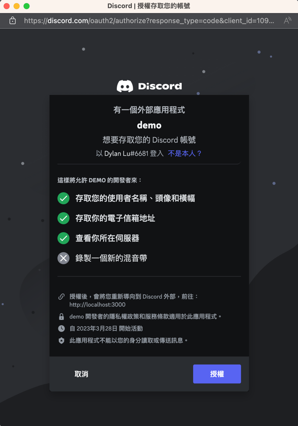

# 🔐 Streamlit OAuth

**A simple wrap for oauth2 authorization code grant flow using httpx_oauth**

## Installation

`pip install streamlit-oauth`

## Getting started

To use Streamlit OAuth, you need to create an OAuth2 component with your authentication details (set your callback url to `https://<YOUR ADDRESS>/component/streamlit_oauth.authorize_button/index.html`):

```python
import streamlit as st
from streamlit_oauth import OAuth2Component
import os

# Load environment variables from .env file
from dotenv import load_dotenv
load_dotenv()

# Set environment variables
AUTHORIZE_URL = os.environ.get('AUTHORIZE_URL')
TOKEN_URL = os.environ.get('TOKEN_URL')
REFRESH_TOKEN_URL = os.environ.get('REFRESH_TOKEN_URL')
REVOKE_TOKEN_URL = os.environ.get('REVOKE_TOKEN_URL')
CLIENT_ID = os.environ.get('CLIENT_ID')
CLIENT_SECRET = os.environ.get('CLIENT_SECRET')
REDIRECT_URI = os.environ.get('REDIRECT_URI')
SCOPE = os.environ.get('SCOPE')

# Create OAuth2Component instance
oauth2 = OAuth2Component(CLIENT_ID, CLIENT_SECRET, AUTHORIZE_URL, TOKEN_URL, REFRESH_TOKEN_URL, REVOKE_TOKEN_URL)

# Check if token exists in session state
if 'token' not in st.session_state:
    # If not, show authorize button
    result = oauth2.authorize_button("Authorize", REDIRECT_URI, SCOPE)
    if result and 'token' in result:
        # If authorization successful, save token in session state
        st.session_state.token = result.get('token')
        st.experimental_rerun()
else:
    # If token exists in session state, show the token
    token = st.session_state['token']
    st.json(token)
    if st.button("Refresh Token"):
        # If refresh token button is clicked, refresh the token
        token = oauth2.refresh_token(token)
        st.session_state.token = token
        st.experimental_rerun()

```


**Parameters:**

* `client_id`: The OAuth2 client id provided by the authorization server.
* `client_secret`: The OAuth2 client secret provided by the authorization server.
* `authroize_endpoint`: The authorization endpoint URL of the OAuth2 server.
* `token_endpoint`: The token endpoint URL of the OAuth2 server.
* `refresh_token_endpoint`: The refresh token endpoint URL of the OAuth2 server.
* `revoke_token_endpoint`: The revoke token endpoint URL of the OAuth2 server.

### `authorize_button(self, name, redirect_uri, scope, height=800, width=600, key=None)`

Generates an HTML button that initiates the OAuth2 authorization code grant flow. The button opens a popup window that prompts the user to authorize the application.

**Parameters:**

* `name`: The name to be displayed on the button.
* `redirect_uri`: The URL where the authorization server will redirect the user after the authorization process is completed.
* `scope`: The OAuth2 scopes required by the application.
* `height`: The height of the popup window.
* `width`: The width of the popup window.
* `key`: The unique key of the button component.

**Returns:**

* A dictionary containing the authorization code or access token object, depending on the flow.

### `refresh_token(self, token, force=False)`

Refreshes the access token using the refresh token. If the token is not expired, the function returns the same token.

**Parameters:**

* `token`: The access token object to be refreshed.
* `force`: A boolean value that forces the refresh token to be used, even if the access token is not expired.

**Returns:**

* A dictionary containing the new access token or the same access token if it has not expire

## Demo





